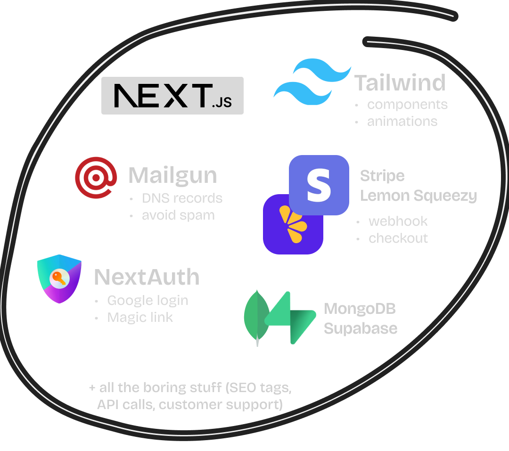

# Best SaaS Kit Pro 🚀

A modern, production-ready SaaS starter kit built with Next.js 15, TypeScript, Tailwind CSS, and more. Perfect for launching your next SaaS project quickly and efficiently.



## 🌟 Features

- ⚡ **Next.js 15** with App Router & Server Actions
- 🎨 **Tailwind CSS 3.3** & **shadcn/ui** for beautiful UI
- 📱 **Fully Responsive** design
- 🔐 **Authentication** with Supabase
- 💳 **Stripe Integration** for payments
- 📧 **Email Integration** with Resend
- 🎯 **SEO Optimized**
- 🌙 **Dark Mode** ready
- 🔍 **Type Safe** with TypeScript 5.3

## 🚀 Getting Started

### Prerequisites

Before you begin, ensure you have the following installed:
- [Node.js](https://nodejs.org/) (version 18.17 or higher)
- [Git](https://git-scm.com/)
- [npm](https://www.npmjs.com/) (comes with Node.js)

### Step-by-Step Installation Guide

1. **Clone the Repository**
   ```bash
   git clone https://github.com/zainulabedeen123/best-saas-kit.git
   ```

2. **Navigate to Project Directory**
   ```bash
   cd best-saas-kit
   ```

3. **Install Dependencies**
   ```bash
   npm install
   ```

4. **Set Up Environment Variables**
   - Copy the example environment file:
     ```bash
     cp .env.example .env.local
     ```
   - Open `.env.local` and fill in your environment variables:
     ```env
     # App
     NEXT_PUBLIC_APP_URL=http://localhost:3000

     # Supabase
     NEXT_PUBLIC_SUPABASE_URL=your_supabase_url
     NEXT_PUBLIC_SUPABASE_ANON_KEY=your_supabase_anon_key
     SUPABASE_SERVICE_ROLE_KEY=your_service_role_key

     # Stripe
     STRIPE_SECRET_KEY=your_stripe_secret_key
     STRIPE_WEBHOOK_SECRET=your_webhook_secret
     NEXT_PUBLIC_STRIPE_PUBLISHABLE_KEY=your_publishable_key

     # Email (Resend)
     RESEND_API_KEY=your_resend_api_key
     ```

5. **Run Development Server**
   ```bash
   npm run dev
   ```

6. **Open Your Browser**
   Visit [http://localhost:3000](http://localhost:3000) to see your application running.

## 🔧 Configuration Guide

### Setting Up Supabase

1. Create a [Supabase](https://supabase.com/) account
2. Create a new project
3. Go to Project Settings > API
4. Copy the URL and anon key to your `.env.local`

### Setting Up Stripe

1. Create a [Stripe](https://stripe.com/) account
2. Get your API keys from the Stripe Dashboard
3. Add them to your `.env.local`
4. Set up webhook endpoints (detailed in documentation)

### Setting Up Email with Resend

1. Create a [Resend](https://resend.com/) account
2. Get your API key
3. Add it to your `.env.local`

## 📚 Project Structure

```
best-saas-kit/
├── src/
│   ├── app/             # Next.js app router pages
│   ├── components/      # React components
│   ├── lib/            # Utility functions
│   └── styles/         # Global styles
├── public/             # Static assets
├── prisma/            # Database schema
└── ...config files
```

## 🛠️ Development Tools

- **Code Quality**
  - ESLint for code linting
  - Prettier for code formatting
  - TypeScript for type safety

- **Git Hooks**
  - Husky for Git hooks
  - lint-staged for staged files linting

## 🤝 Contributing

We welcome contributions! Please feel free to submit a Pull Request.

1. Fork the repository
2. Create your feature branch (`git checkout -b feature/AmazingFeature`)
3. Commit your changes (`git commit -m 'Add some AmazingFeature'`)
4. Push to the branch (`git push origin feature/AmazingFeature`)
5. Open a Pull Request

## 📝 License

This project is licensed under the MIT License - see the [LICENSE](LICENSE) file for details.

## 🙏 Acknowledgments

- [Next.js](https://nextjs.org/)
- [Tailwind CSS](https://tailwindcss.com/)
- [shadcn/ui](https://ui.shadcn.com/)
- [Supabase](https://supabase.com/)
- [Stripe](https://stripe.com/)
- [Resend](https://resend.com/)

## 💬 Support

If you have any questions or need help, please open an issue or contact us at info@themetaversecompany.uk

---

Built with ❤️ by [Zain UI Abedeen](https://github.com/zainulabedeen123)
